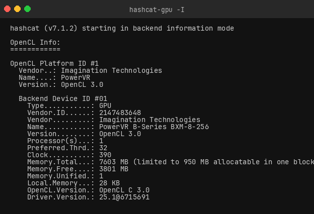
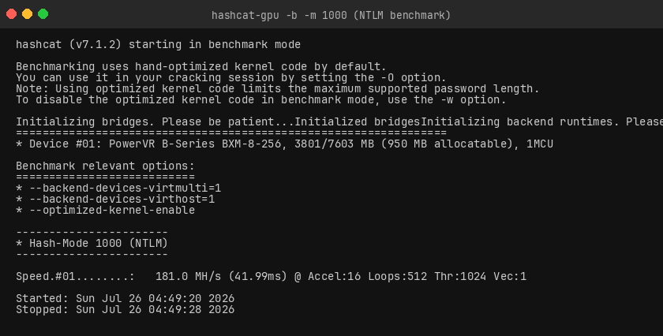
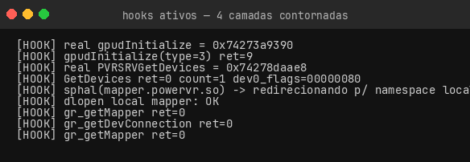
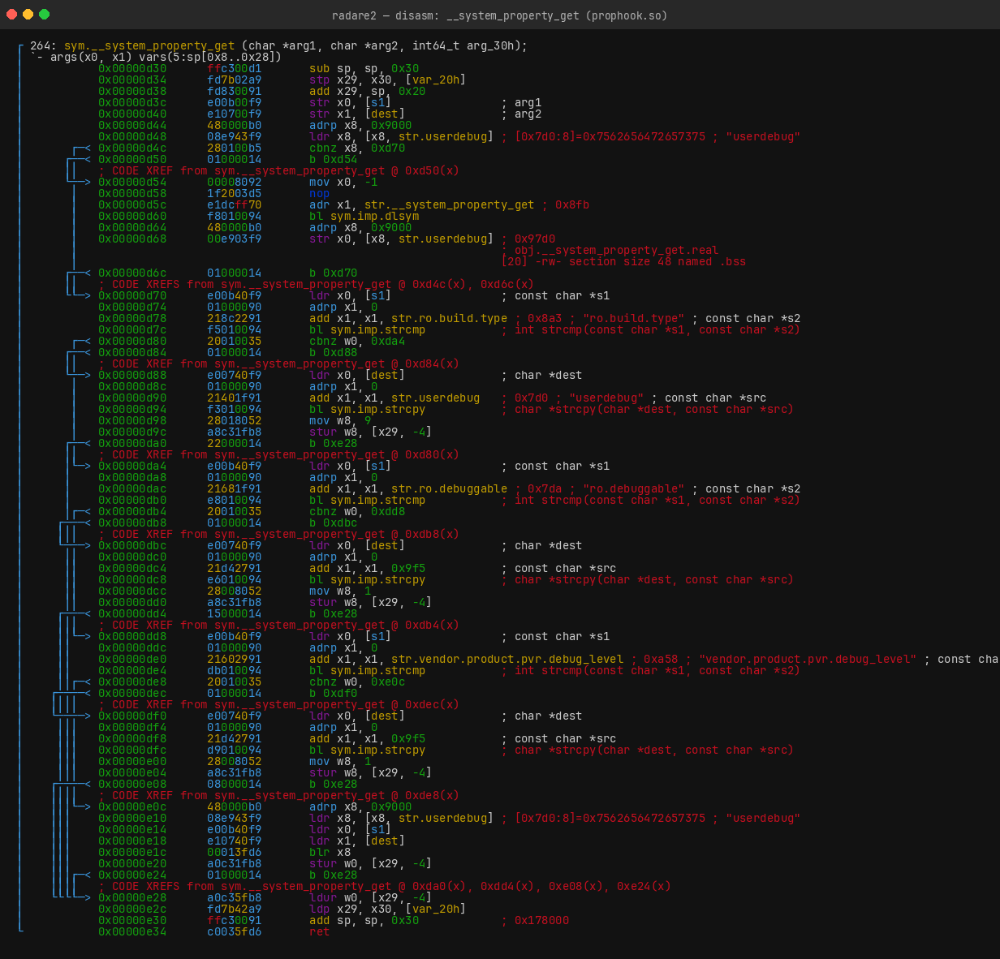
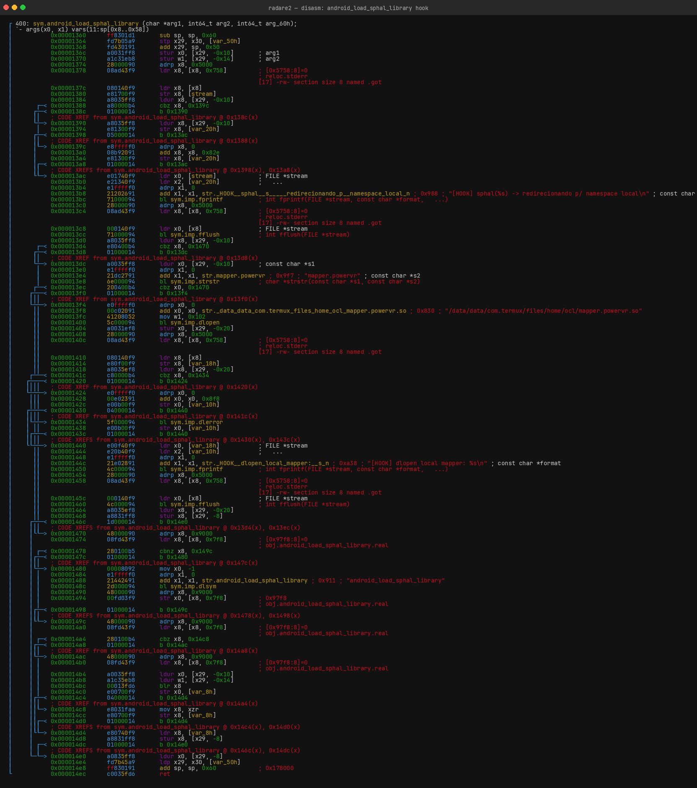
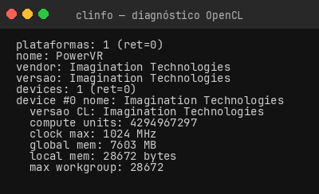
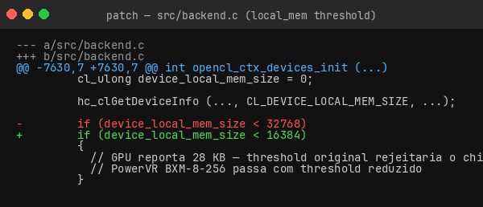

<div align="center">

# ⚡ hascat

### hashcat com GPU PowerVR no Termux — sem root, sem proot

[](https://termux.dev)
[](https://github.com/Sleep6ixteen/hascat)
[](https://www.khronos.org/opencl/)
[](https://hashcat.net)
[](LICENSE)

<br/>

**hashcat v7.1.2** compilado nativo para **Android/aarch64**, usando a GPU  
**PowerVR BXM-8-256 (MediaTek MT6855)** via OpenCL 3.0

> Testado no Motorola Moto G56 5G (XT2423) · Funciona em qualquer aparelho MT6855

</div>

---

## 📊 Performance

<div align="center">

| Algoritmo | Modo | Velocidade |
|:---------:|:----:|:----------:|
| MD5 | `-m 0` | **~82 MH/s** |
| NTLM | `-m 1000` | **~181 MH/s** |

**GPU:** PowerVR BXM-8-256 · 390 MHz · 7.6 GB unified · OpenCL 3.0 · driver 25.1

</div>

---

## 🚀 Uso rápido

```bash
# Ver GPU detectada
hashcat-gpu -I

# Benchmark
hashcat-gpu -b -m 1000          # NTLM (~181 MH/s)

# Quebra com wordlist
hashcat-gpu -m 0    hashes.txt wordlist.txt         # MD5
hashcat-gpu -m 1000 hashes.txt wordlist.txt         # NTLM

# Força bruta
hashcat-gpu -m 1000 hashes.txt -a 3 ?l?l?l?l?d?d

# Com regras
hashcat-gpu -m 1000 hashes.txt wordlist.txt -r rules/best64.rule
```

> Todos os argumentos são repassados diretamente ao hashcat —
> a [documentação oficial](https://hashcat.net/wiki/) vale 100% aqui.

### `hashcat-gpu -I` — GPU detectada



### `hashcat-gpu -b -m 1000` — Benchmark NTLM (~181 MH/s)



### Hooks ativos — prova das 4 camadas contornadas



---

## 🧩 Como funciona — a ponte

O driver OpenCL do chip está em `/vendor/lib64`, mas **bloqueado para apps
por 4 camadas independentes**. Este projeto contorna todas:

<details>
<summary><b>Camada 1 — Namespace do linker</b></summary>

As libs do driver vivem num namespace isolado do linker Android e são
invisíveis para processos de app. Solução: copiar as libs para `~/ocl/`
e patchear os caminhos absolutos embutidos nos binários
(`/vendor/lib64/...`) para nomes relativos — o linker os encontra via
`LD_LIBRARY_PATH=~/ocl`.

</details>

<details>
<summary><b>Camada 2 — Propriedades de build</b></summary>

O driver verifica `ro.build.type` e `ro.debuggable` antes de inicializar.
Em builds de produção (`user`) ele recusa.

**Solução:** `prophook.so` (via `LD_PRELOAD`) intercepta
`__system_property_get` e reporta build `userdebug` + `ro.debuggable=1`.



</details>

<details>
<summary><b>Camada 3 — Gate do gralloc <code>(-22)</code></b></summary>

`mapper.powervr.so` era carregado via `android_load_sphal_library`, que
força o carregamento no namespace isolado `sphal`. O módulo então
registrava a conexão OpenCL numa instância diferente da do processo →
`gr_getDevConnection = -22` (EINVAL).

**Solução:** `prophook.so` também intercepta `android_load_sphal_library`
e redireciona para `dlopen` normal, no namespace correto do processo.



</details>

<details>
<summary><b>Camada 4 — Requisito de local memory do hashcat</b></summary>

O hashcat rejeita GPUs com `device_local_mem_size < 32 KB`.
A PowerVR BXM-8-256 reporta **28 KB**.

**Solução:** patch em `src/backend.c` reduzindo o threshold de
`32768` → `16384`, deixando o chip passar na verificação.

</details>

---

## 📁 Arquivos do repositório

| Arquivo | Descrição |
|---------|-----------|
| [`prophook.c`](prophook.c) | Hooks de namespace, propriedades de build e sphal |
| [`hashcat-gpu.sh`](hashcat-gpu.sh) | Wrapper que exporta as variáveis e chama o hashcat |
| [`clinfo.c`](clinfo.c) | Diagnóstico OpenCL — lista plataformas e devices |

> **Por que os `.so` não estão no repo?**  
> As libs do driver são propriedade da Imagination Technologies / MediaTek
> e não podem ser redistribuídas. Os binários compilados são reproduzíveis
> seguindo o guia abaixo.

---

## 🔧 Reproduzir do zero

### Pré-requisitos

```bash
pkg update && pkg install clang git make python3
```

- Aparelho com chip **MediaTek MT6855** e GPU **PowerVR BXM-8-256**
- Termux com acesso a `/vendor/lib64` (sem root — o Termux já tem permissão de leitura)

---

### Passo 1 — Estrutura de pastas

```bash
mkdir -p ~/ocl/vendors
```

---

### Passo 2 — Copiar as libs do driver

```bash
# Libs principais
cp /vendor/lib64/libOpenCL.so          ~/ocl/
cp /vendor/lib64/libsrv_um.so          ~/ocl/
cp /vendor/lib64/libusc.so             ~/ocl/
cp /vendor/lib64/libgpud.so            ~/ocl/
cp /vendor/lib64/libmpvr.so            ~/ocl/
cp /vendor/lib64/libgralloc_extra.so   ~/ocl/
cp /vendor/lib64/libged.so             ~/ocl/

# Subdiretório mt6855
cp /vendor/lib64/mt6855/libPVRMtkutils.so      ~/ocl/
cp /vendor/lib64/mt6855/libpvr_mapper_utils.so ~/ocl/
cp /vendor/lib64/mt6855/libPVROCL.so           ~/ocl/
cp /vendor/lib64/mt6855/libPVROCL.so           ~/ocl/libPVROCL.so.bak  # backup

# Mapper gralloc
cp /vendor/lib64/hw/mt6855/mapper.powervr.so   ~/ocl/
```

---

### Passo 3 — Patchear caminhos absolutos nos binários

O driver tem caminhos hardcoded (`/vendor/lib64/...`). É preciso
substituí-los por nomes relativos para o linker resolver via
`LD_LIBRARY_PATH`.

```bash
# Verificar quais libs têm caminhos absolutos
for f in ~/ocl/*.so; do
  strings "$f" | grep -q '/vendor/lib64' && echo "$(basename $f) — tem caminhos"
done
```

```bash
# Patchear com Python (preserva tamanho dos binários com padding \0)
cd ~/ocl
python3 - << 'PYEOF'
import os

def patch_lib(path):
    with open(path, 'rb') as f:
        data = f.read()
    changed = False
    for prefix in [b'/vendor/lib64/mt6855/', b'/vendor/lib64/hw/mt6855/',
                   b'/vendor/lib64/hw/',     b'/vendor/lib64/',
                   b'/system/vendor/lib64/']:
        while prefix in data:
            idx = data.index(prefix)
            end = data.index(b'\x00', idx)
            original = data[idx:end]
            filename  = original[len(prefix):]
            replacement = filename + b'\x00' * len(prefix)
            data = data[:idx] + replacement + data[end:]
            changed = True
            print(f"  patched: {original.decode(errors='replace')} -> {filename.decode(errors='replace')}")
    if changed:
        with open(path, 'wb') as f:
            f.write(data)

for fname in sorted(os.listdir('.')):
    if fname.endswith('.so') and not fname.endswith('.bak'):
        patch_lib(fname)
print("\nPatching concluído.")
PYEOF
```

---

### Passo 4 — Arquivo ICD (registro da plataforma OpenCL)

```bash
echo "$HOME/ocl/libPVROCL.so" > ~/ocl/vendors/pvr.icd
```

---

### Passo 5 — Compilar o prophook.so

```bash
# Ajustar o $HOME hardcoded no fonte (necessário se seu usuário for diferente)
sed -i "s|/data/data/com.termux/files/home|$HOME|g" ~/ocl/prophook.c

# Compilar
clang -shared -fPIC -O2 -o ~/ocl/prophook.so ~/ocl/prophook.c -ldl
```

---

### Passo 6 — Compilar o clinfo (diagnóstico)

```bash
clang -o ~/clinfo ~/clinfo.c \
  -I$PREFIX/include \
  -L~/ocl -lOpenCL

# Testar
LD_PRELOAD=~/ocl/prophook.so \
OCL_ICD_VENDORS=~/ocl/vendors \
LD_LIBRARY_PATH=~/ocl \
~/clinfo
```

Saída esperada:



✅ `plataformas: 1` + `local mem: 28672 bytes` = ponte funcionando.

---

### Passo 7 — Compilar o hashcat com patch

```bash
git clone --depth=1 https://github.com/hashcat/hashcat.git ~/hashcat
cd ~/hashcat

# Patch: threshold de local memory 32 KB -> 16 KB (GPU reporta 28 KB)
sed -i 's/device_local_mem_size < 32768/device_local_mem_size < 16384/' src/backend.c
```



```bash
# Confirmar o patch
grep "device_local_mem_size < " src/backend.c | grep -v dynamic

# Compilar
make -j$(nproc) IS_ARM=1 CXXFLAGS="-DLITTLE_ENDIAN"
```

---

### Passo 8 — Instalar o wrapper

```bash
cp hashcat-gpu.sh $PREFIX/bin/hashcat-gpu
chmod +x $PREFIX/bin/hashcat-gpu

# Ajustar $HOME se necessário
sed -i "s|/data/data/com.termux/files/home|$HOME|g" $PREFIX/bin/hashcat-gpu
```

O wrapper é mínimo — apenas exporta as variáveis e delega ao binário:

```bash
#!/data/data/com.termux/files/usr/bin/bash
export LD_PRELOAD="$HOME/ocl/prophook.so"
export OCL_ICD_VENDORS="$HOME/ocl/vendors"
export LD_LIBRARY_PATH="$HOME/ocl"
exec "$HOME/hashcat/hashcat" "$@"
```

---

### Passo 9 — Testar ✅

```bash
hashcat-gpu -I          # lista a GPU PowerVR
hashcat-gpu -b -m 1000  # benchmark NTLM → esperado ~176 MH/s
```

---

## ⚠️ Problemas conhecidos

| Problema | Causa | Solução |
|----------|-------|---------|
| GPU não aparece sem o wrapper | Faltam `LD_PRELOAD` / `OCL_ICD_VENDORS` / `LD_LIBRARY_PATH` | Sempre use `hashcat-gpu` |
| Quebra após OTA | Libs em `/vendor/lib64` mudam | Recopiar e repatchear (`.bak` é referência) |
| Self-test falha em alguns modos | Quirk do driver mobile | `--self-test-disable` + verificar resultados |
| Nome/vendor errados no clinfo | Quirk do driver | Inofensivo |
| `gr_getDevConnection = -22` | mapper no namespace `sphal` errado | Corrigido pelo hook `android_load_sphal_library` |

---

## 🗂️ Mapa de arquivos (instalação completa)

```
$PREFIX/bin/hashcat-gpu       wrapper — ponto de entrada
~/hashcat/hashcat             binário do hashcat v7.1.2
~/ocl/
├── libOpenCL.so              ICD loader
├── libPVROCL.so              driver OpenCL PowerVR (patched)
├── libPVROCL.so.bak          driver original (referência)
├── libsrv_um.so              serviços PowerVR
├── libusc.so / libgpud.so    shader compiler / GPU daemon
├── libmpvr.so                suporte MediaTek-PVR
├── libgralloc_extra.so       gralloc extensões
├── libged.so                 GPU engine driver
├── libPVRMtkutils.so         utils MTK
├── libpvr_mapper_utils.so    mapper utils
├── mapper.powervr.so         gralloc mapper
├── prophook.c / prophook.so  hooks (a ponte)
└── vendors/pvr.icd           registro da plataforma OpenCL
~/clinfo                      diagnóstico OpenCL
```

---

## 📄 Licença

O código deste repositório (`prophook.c`, `clinfo.c`, `hashcat-gpu.sh`) é livre —
use, modifique e redistribua à vontade.

- **hashcat** — licença MIT: [github.com/hashcat/hashcat](https://github.com/hashcat/hashcat)
- **Libs do driver PowerVR** — propriedade da Imagination Technologies / MediaTek,
  não incluídas neste repo.

---

<div align="center">
<sub>Feito no Termux · Moto G56 5G · PowerVR BXM-8-256 · OpenCL 3.0</sub>
</div>
